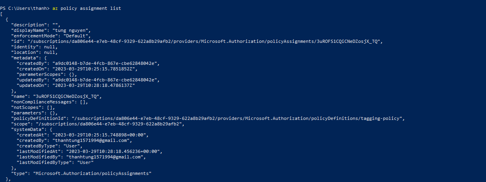
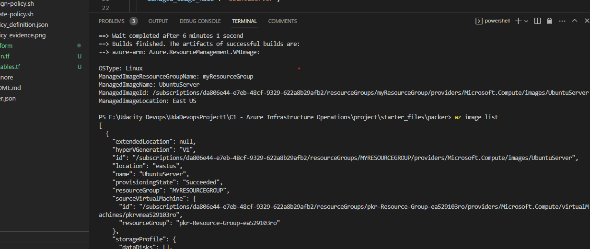
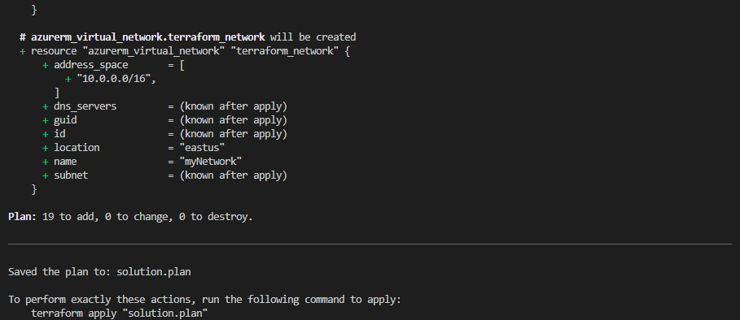
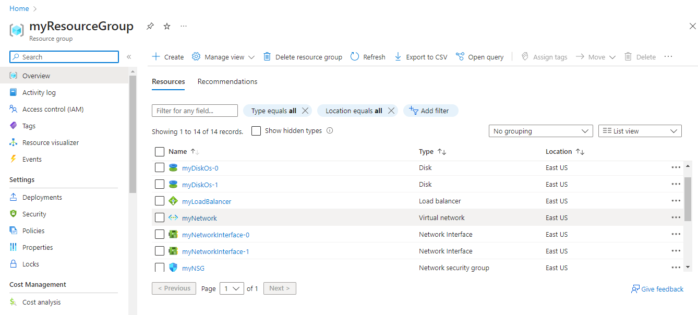

# Azure Infrastructure Operations Project: Deploying a scalable IaaS web server in Azure

### Introduction
For this project, you will write a Packer template and a Terraform template to deploy a customizable, scalable web server in Azure.

### Getting Started
1. Clone this repository

2. Create your infrastructure as code

3. Update this README to reflect how someone would use your code.

### Dependencies
1. Create an [Azure Account](https://portal.azure.com) 
2. Install the [Azure command line interface](https://docs.microsoft.com/en-us/cli/azure/install-azure-cli?view=azure-cli-latest)
3. Install [Packer](https://www.packer.io/downloads)
4. Install [Terraform](https://www.terraform.io/downloads.html)

### Instructions
1. Policy
    . az login - login to Azure by using your account
    . cd policy - move to Policy directory 
    . Create a new policy definition by using script create-policy.sh
    . Assign the new policy by using script assign-policy.sh
2. Packer
    . Create a resource group : az group create -n myResourceGroup -l eastus
    . Create Azure credentials to get information from output : az ad sp create-for-rbac --role Contributor --scopes /subscriptions/<subscription_id> --query "{ client_id: appId, client_secret: password, tenant_id: tenant }"
    . Crate packer image template: refer to packer/ubuntu_image.json
    . Run script: 'packer build ubuntu_image.json' to create the image in Azure 
3. Terraform
    . Create file main.tf to define the resources that will be created by using Infrastructure code.
    . Create file variables.tf to define the variables that will be used in main.tf file.
        -> you can change resource group name, location, admin username, admin password, number of VMs that to be created by replacing your configurations.
    . Run terraform.init to initialize the needed providers
    . Run terraform plan -out solution.plan to create plan to deploy to Azure
    . Run terraform apply solution.plan to deploy all resources that were defined to Azure
    . Run terraform destroy to delete all resources once done.
    . Delete image that was created before.

### Output
1. Policy
See policy is created in the terminal.

2. Packer

3. Terraform

